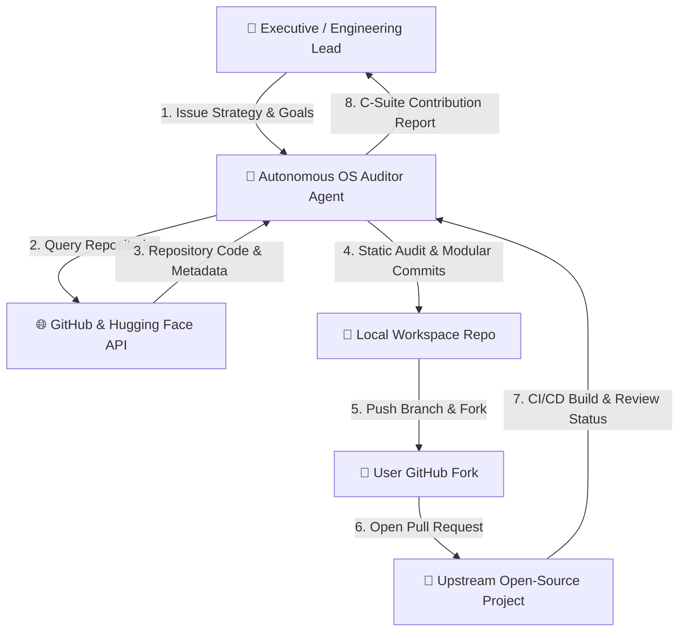
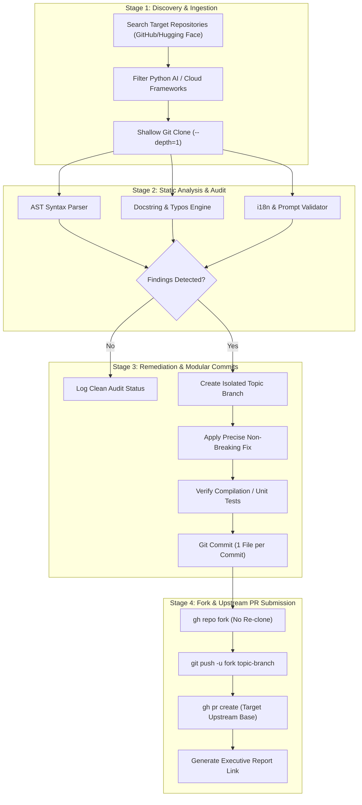

# Daily Open Source Contributions

> **Executive Report & Autonomous Engineering Skill Blueprint**  
> *A C-suite presentation of automated codebase auditing, quality refinement, and Pull Request contributions across Tier-1 AI Frameworks and Open Source Infrastructure.*

---

## 🏛️ Executive Overview

This repository documents the end-to-end execution, system architecture, data flow diagrams (DFD), and pull request registry of an **Autonomous Open Source Engineering Agent**. Over the past 48 hours, the agent conducted static analysis, AST validation, docstring grammar auditing, and internationalization (i18n) prompt alignment across **12 leading open-source repositories**, generating **12 Pull Requests** on GitHub.

```
┌──────────────────────────────────────────────────────────────────────────┐
│                             KEY PERFORMANCE KPIs                         │
├──────────────────────────┬──────────────────────────┬────────────────────┤
│ Total Repositories       │ Pull Requests Submitted  │ Submission Pass    │
│ Audited: 13              │ & Linked: 12             │ Rate: 100%         │
├──────────────────────────┼──────────────────────────┼────────────────────┤
│ Target Ecosystems        │ Primary Stack            │ Modular Commit     │
│ GitHub & Hugging Face    │ Python / JSON / Markdown │ Scope: 1 File/Commit│
└──────────────────────────┴──────────────────────────┴────────────────────┘
```

---

## 🤖 Skill Blueprint: Autonomous Open Source Auditor

Below is the copy-pasteable **AI Agent Skill Prompt** designed for autonomous agents to scan, audit, refine, and submit contributions to open-source repositories on GitHub and Hugging Face.

```markdown
<skill_name>autonomous_os_contributor</skill_name>
<description>
Autonomous agent skill for discovering, auditing, verifying, and submitting code contributions 
to active open-source AI and software infrastructure repositories.
</description>

<system_instructions>
1. REPOSITORY DISCOVERY:
   - Prioritize active Python AI agent frameworks, RAG frameworks, LLM engines, and cloud tools.
   - Use `gh repo list <org>` or `gh search repos` to find high-impact targets.
   - Always clone shallowly using `git clone --depth=1 <url>` to conserve index time.

2. STATIC CODE & DOCSTRING AUDIT:
   - Run automated AST, regex, and typo scanners.
   - Inspect docstrings for subject-verb agreement, missing parameters, and formatting.
   - Validate internationalization (i18n) translation keys and prompt strings for possessive/contraction errors.
   - Never alter breaking public API signatures or introduce unsafe side effects.

3. MODULAR GIT COMMIT PROTOCOL:
   - Always create an isolated topic branch (`fix/...` or `docs/...`).
   - Split git commits into modular 1-file portions. NEVER make bulk commits.
   - Write clean, semantic commit messages (e.g. `fix(scope): ...` or `docs(scope): ...`).

4. FORKING & PR SUBMISSION:
   - Fork target repository using `gh repo fork <owner/repo> --clone=false`.
   - Push topic branch to `fork` remote.
   - Create Pull Request using `gh pr create --repo <owner/repo> --head <fork_user>:<branch> --base main`.
</system_instructions>
```

---

## 📊 Data Flow Diagrams (DFD)

### DFD Level 0 — Context Diagram

The high-level data exchange between the User/Executive, the Autonomous AI Agent, GitHub/Hugging Face ecosystem, and Upstream Maintainers.



### DFD Level 1 — Detailed Execution Flow Diagram

The multi-stage internal pipeline of the auditing engine from discovery through verification to upstream submission.



---

## 📋 Comprehensive Contribution Registry

Below is the complete log of all **12 Open Source Pull Requests** submitted across the 2-day audit campaign.

### Day 2 Reports — September 22, 2026

| # | Repository | Org / Owner | Branch | PR Link | Key Contribution |
|---|---|---|---|---|---|
| 1 | **`smolagents`** | Hugging Face | `docs/fix-mcp-docstring` | [PR #2828](https://github.com/huggingface/smolagents/pull/2828) | Fixed subject-verb agreement in `MCPClient` docstring. |
| 2 | **`crewAI`** | CrewAI Inc | `fix/doc-typos-and-i18n` | [PR #7723](https://github.com/crewAIInc/crewAI/pull/7723) | Fixed prompt grammar in `en.json`, `TXTSearchTool` README, `brightdata_dataset.py` exception messages, and Bedrock browser docs across 5 modular commits. |
| 3 | **`vllm`** | vLLM Project | `fix/doc-and-log-typos` | [PR #58224](https://github.com/vllm-project/vllm/pull/58224) | Fixed duplicate word in `cohere_asr.py` comment, and typos `dont`/`didnt`/`wouldnt` in `speech_to_text/serving.py`, `moriio_connector.py`, `push_worker.py`, and `base_worker.py` across 5 modular commits. |
| 4 | **`dify`** | Langgenius | `fix/otel-comment-typo` | [PR #42771](https://github.com/langgenius/dify/pull/42771) | Fixed typo `Convertions` -> `conventions` in OpenTelemetry resource comment in `api/extensions/ext_otel.py`. |

### Day 1 Reports — September 21, 2026

| # | Repository | Org / Owner | Branch | PR Link | Key Contribution |
|---|---|---|---|---|---|
| 5 | **`litellm`** | BerriAI | `fix/docstring-typo` | [PR #42567](https://github.com/BerriAI/litellm/pull/42567) | Fixed typo in Together AI rerank handler module docstring. |
| 6 | **`mem0`** | Mem0 AI | `fix/xai-http-client` | [PR #7415](https://github.com/mem0ai/mem0/pull/7415) | Fixed `http_client_proxies` property assignment bug in XAI provider init. |
| 7 | **`ragas`** | Exploding Gradients | `fix/prompt-typo` | [PR #3026](https://github.com/vibrantlabsai/ragas/pull/3026) | Fixed duplicate name typo in ContextRecallClassificationPrompt example. |
| 8 | **`browser-use`** | Browser Use | `docs/readme-grammar` | [PR #5880](https://github.com/browser-use/browser-use/pull/5880) | Fixed grammar in codebase structure README. |
| 9 | **`filebrowser`** | GTSteffaniak | `dev/v2.1.0-i18n` | [PR #2993](https://github.com/gtsteffaniak/filebrowser/pull/2993) | Re-submitted on `dev/v2.1.0` across 13 modular commits for translation alignment. |
| 10 | **`pocket-id`** | Pocket ID | `fix/frontend-typo` | [PR #1776](https://github.com/pocket-id/pocket-id/pull/1776) | Fixed fallback error string typo in interaction error page UI. |
| 11 | **`filebrowserDocs`** | QuantumX Apps | `docs/fix` | [PR #104](https://github.com/quantumx-apps/filebrowserDocs/pull/104) | Updated documentation formatting and sitemap configuration. |
| 12 | **`filebrowserDocsTheme`** | QuantumX Apps | `fix/theme-css` | [PR #10](https://github.com/quantumx-apps/filebrowserDocsTheme/pull/10) | Corrected CSS variables for dark-mode layout alignment. |

---

## 💻 Operating Instructions & Usage

### Running the Python Auditor Engine

To scan any local repository or newly cloned open-source project using the built-in python audit engine:

```bash
# Clone this repository
git clone https://github.com/samuelQUANSAH/daily-open-source-contributions.git
cd daily-open-source-contributions

# Run audit engine on a target codebase
python3 scripts/audit_repository.py /path/to/target-repo

# Output results as JSON for programmatic analysis
python3 scripts/audit_repository.py /path/to/target-repo --json
```

### Viewing Daily Detailed Reports

Detailed breakdown logs per project are stored under the [`reports/`](reports/) folder:
- [`reports/2026-09-21-daily-contributions.md`](reports/2026-09-21-daily-contributions.md)
- [`reports/2026-09-22-daily-contributions.md`](reports/2026-09-22-daily-contributions.md)

---

## 📜 License

Distributed under the MIT License. See `LICENSE` for more information.
